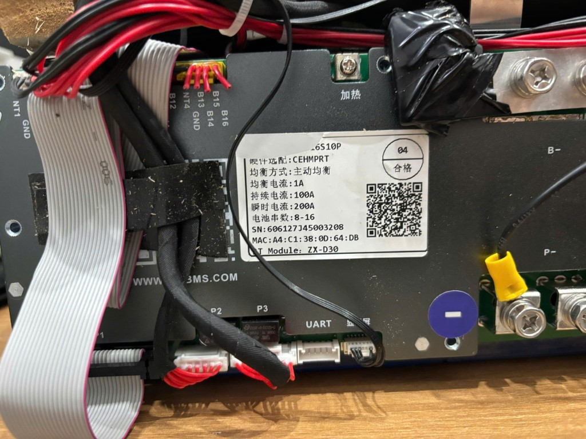
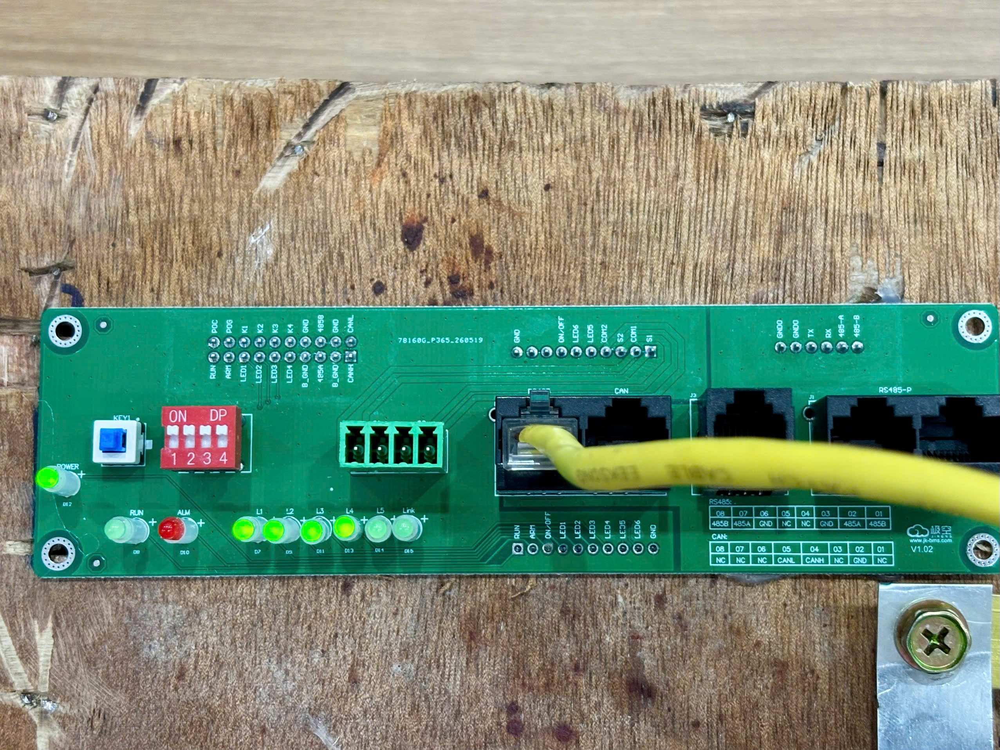
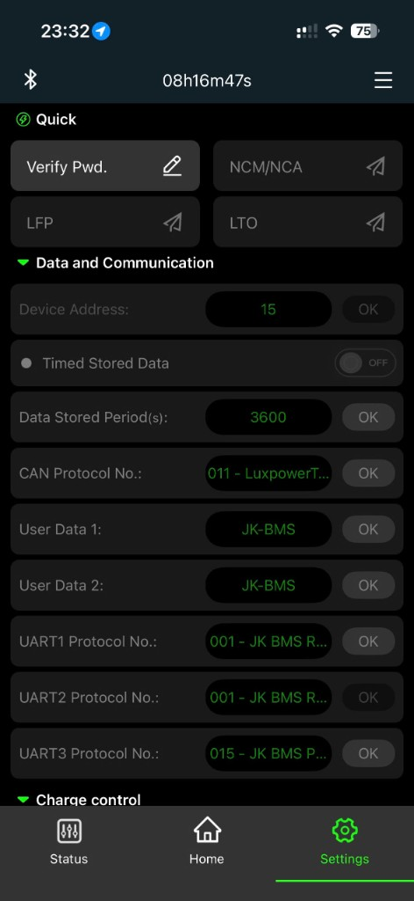
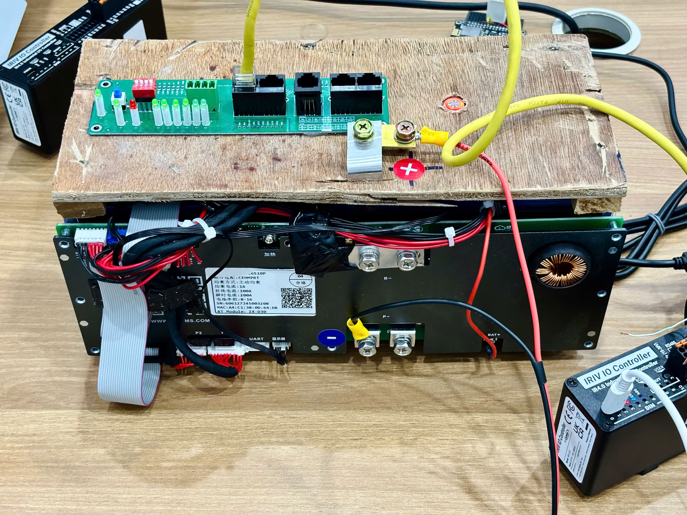
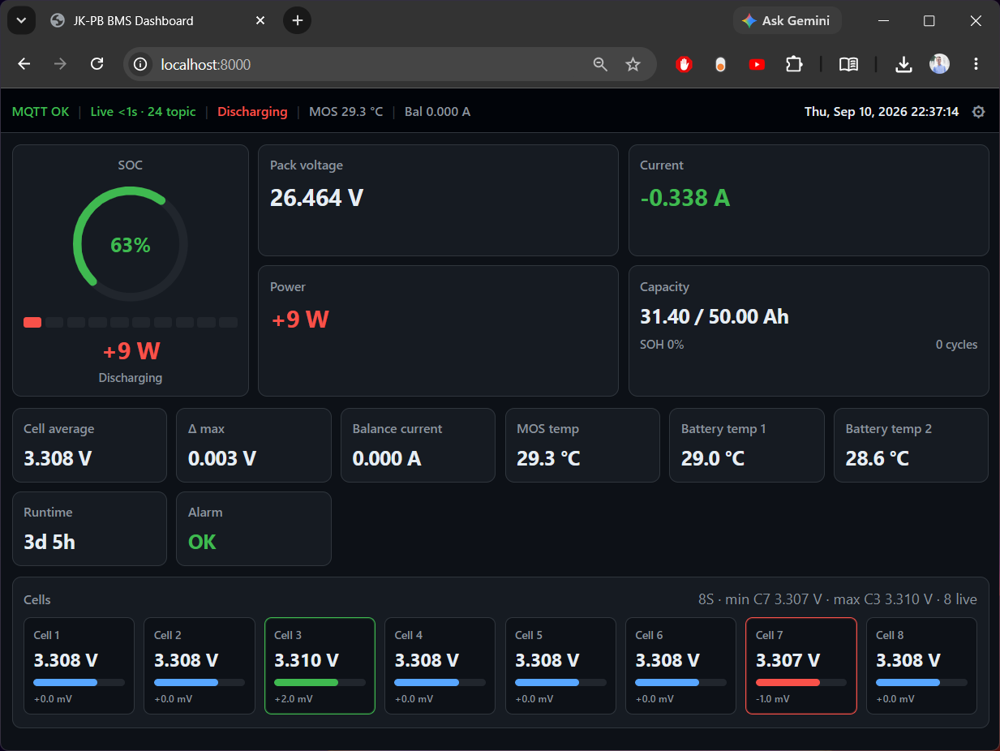
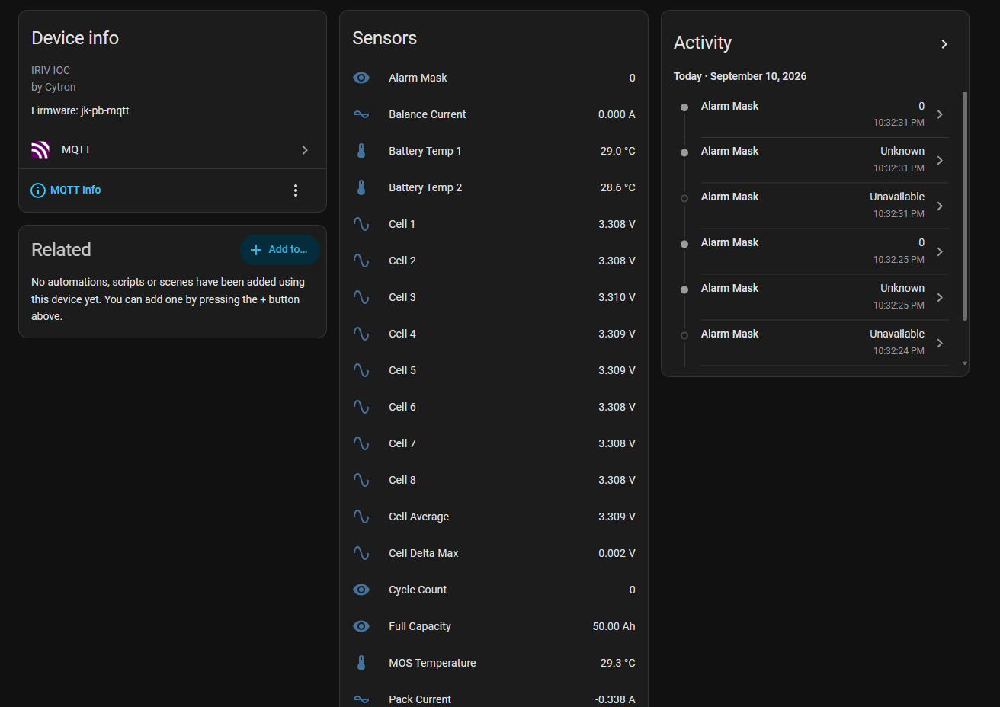
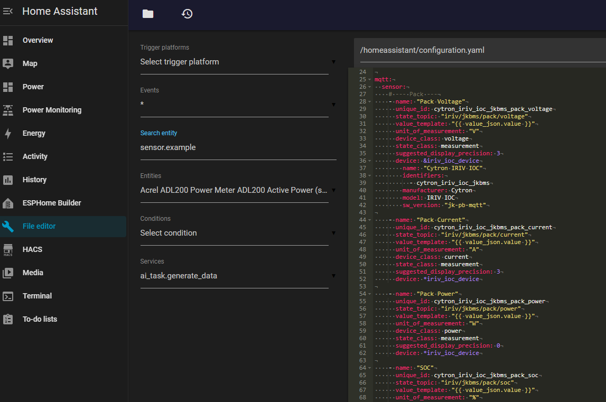
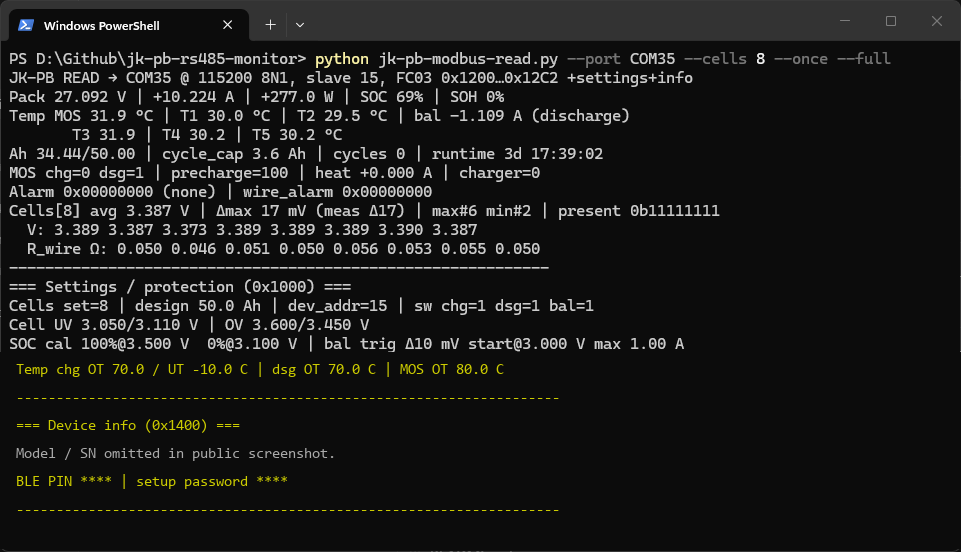
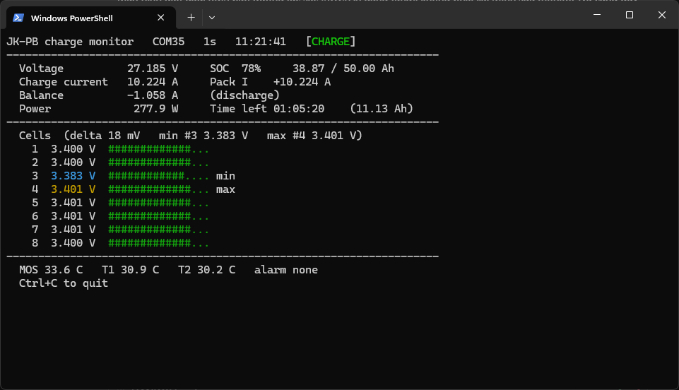

# JK-PB RS485 Monitor

Bộ công cụ **monitor** BMS JiKong **JK-PB\*** qua **Modbus RTU (RS485)** trên UART1: poller PC, firmware MQTT CircuitPython trên Cytron **IRIV IOC** (đọc block), web dashboard, cảm biến Home Assistant, emulator Modbus slave JK, và (dự kiến) poller ESP32 RS485.

> English: [README.md](README.md)  
> **Cursor / agent handoff:** [AGENTS.md](AGENTS.md) · [docs/HANDOFF.md](docs/HANDOFF.md) · `.cursor/rules/lab-context.mdc`

**Dự án chị em:** [deye-sg06-rs485-monitor](../deye-sg06-rs485-monitor) — Modbus biến tần Deye (bus riêng @ 9600).

```text
  [ PC / IRIV IOC / ESP32 ]  = Modbus MASTER
              |
         RS485 A/B @ 115200
              |
  [ JK-PB* UART1 / RJ45 RS485 ngoài cùng bên trái ]  = Modbus SLAVE
              |
         IRIV → MQTT iriv/jkbms/#  →  web / Home Assistant
```

**Một master trên mỗi bus.** Không dùng chung cáp với RS485 datalogger Deye hoặc đường **CAN** của biến tần.

```bash
pip install -r requirements.txt
```

---

## Đã thử nghiệm

| Phần cứng | Kết quả |
|-----------|---------|
| **JK-PB1A16S10P** trên pack nghiên cứu **24 V 8S** (~50 Ah) | UART1 **001**, slave **15**, **115200** — poller PC |
| Firmware CircuitPython **IRIV IOC** | Block FC03 → MQTT `172.16.10.40` / `iriv/jkbms/#` |
| Web dashboard + Home Assistant MQTT | Pack/cells live OK (thiết bị **IRIV IOC - JK BMS**) |
| Cùng họ BMS trên **16S 51.2 V 100 Ah** với Deye | Biến tần = **CAN**; telemetry ESS qua Modbus Deye (repo chị em) |





*I/O trái → phải: **RS485** (UART1) · **CAN** · RJ45 giữa · **RS485-P** ×2. Chân: 1/8=B, 2/7=A, 3/6=GND.*



*Device Address **15**; UART1/2 = **001** JK BMS RS485 Modbus; UART3 = **015** parallel.*



*Lab pack 24 V 8S — đường monitor JK-PB.*

---

## Ảnh chụp — IRIV IOC - JK BMS



*Giao diện web MQTT (`web/`) — pack, SOC, cells (8S).*



*Thiết bị Home Assistant **IRIV IOC - JK BMS** (Cytron Technologies).*



*Gói cảm biến MQTT thủ công trên HA.*

---

## Nội dung trong repo

| Khu vực | File |
|---------|------|
| **PC poller (master)** | `jk-pb-modbus-read.py` (đọc) · `jk-pb-modbus-write.py` (giới hạn dòng / balancer) · `jk-pb-charge-monitor.py` (màn hình sạc) |
| **IRIV IOC** | [`iriv-ioc/`](iriv-ioc/) — cài đặt + broker MQTT: [`iriv-ioc/README.md`](iriv-ioc/README.md); firmware trong `iriv-ioc/firmware/` |
| **Web dashboard** | [`web/`](web/) — MQTT qua WebSockets (`iriv/jkbms/#`) |
| **Home Assistant** | [`homeassistant/`](homeassistant/) — thiết bị **IRIV IOC - JK BMS** by Cytron Technologies |
| **Bench JK slave** | [`emulator/`](emulator/) — `jk-pb-emu.py` (map live protocol **001**) |
| **ESP32 RS485 poller** | [`esp32/`](esp32/) (stub) |
| **Datasheet** | [`iriv-ioc/`](iriv-ioc/) |

Chuỗi pack **4S / 8S / 16S**: đặt `JK_CELLS` trong `settings.toml` firmware, `CELL_COUNT` trong `web/app.js`, và block cell tương ứng trong YAML HA (lab mặc định **8S**).

Không dùng JSON stock IRIV **MQTT Gateway** (đọc từng thanh ghi — độ trễ cao).

---

## Tham số Modbus chính

| Tham số | Giá trị |
|---------|---------|
| Cổng | RJ45 **RS485** ngoài cùng bên trái (UART1) |
| Baud | **115200** 8N1 (app `001`) |
| Slave ID | **15** (DIP all ON) |
| Protocol | JK BMS RS485 Modbus V1.0 |

Thanh ghi chính: cells `0x1200+`; pack V `0x1290` u32×0.001; current `0x1298` s32×0.001; SOC = low byte `0x12A6`.

### PC poller

```bash
python jk-pb-modbus-read.py --port COM35 --cells 8
python jk-pb-modbus-read.py --port COM35 --cells 8 --once --full
```

`--full` in thêm BLE PIN và mật khẩu Authorize Settings từ `0x1400`. Chỉ đọc.



*`jk-pb-modbus-read.py --once --full` — pack/cells live, block bảo vệ, thông tin thiết bị.*

### Theo dõi sạc (terminal)

```bash
python jk-pb-charge-monitor.py --port COM35 --cells 8
python jk-pb-charge-monitor.py --port COM35 --cells 8 --interval 1
```

Màn hình PowerShell tự refresh: điện áp pack, dòng sạc, dòng cân bằng, công suất, thời gian sạc còn lại, điện áp từng cell. Ctrl+C để thoát. Chỉ đọc.



*`jk-pb-charge-monitor.py` — theo dõi sạc trên terminal, tự refresh.*

### PC writer

```bash
python jk-pb-modbus-write.py --port COM35
python jk-pb-modbus-write.py --port COM35 --set-charge-a 10 --set-discharge-a 50 --balance on
python jk-pb-modbus-write.py --port COM35 --set-charge-a 10 --yes
```

FC16 tới `CurBatCOC` (`0x102C`), `CurBatDcOC` (`0x1038`), `BalanEN` (`0x1078`). Không có `--yes` thì chỉ dry-run. Phạm vi: sạc 0.5–100 A, xả 1–100 A. Không ghi OVP/UVP/MOS.

### IRIV IOC

Cài đặt và cấu hình broker MQTT: [`iriv-ioc/README.md`](iriv-ioc/README.md).

- Copy `iriv-ioc/firmware/` → CIRCUITPY  
- Sửa **`settings.toml`**: `MQTT_BROKER`, `MQTT_PORT`, `MQTT_BASE`, …  
- Broker lab mặc định: `172.16.10.40:1883`, base `iriv/jkbms`  
- **Một Modbus master** trên bus RS485 của JK  

### Web dashboard

```bash
cd web && python -m http.server 8081
```

Mở `http://127.0.0.1:8081`. WebSocket lab: `ws://172.16.10.40:9001`, prefix `iriv/jkbms`. Xem [web/README.md](web/README.md).

### Home Assistant

```text
homeassistant/mqtt_cytron_iriv_ioc_jkbms.yaml
```

Thiết bị **IRIV IOC - JK BMS** · manufacturer **Cytron Technologies**. Xem [homeassistant/README.md](homeassistant/README.md).

### Emulator Modbus slave JK (bench)

```bash
python emulator/jk-pb-emu.py --port COM36 --cells 8 --debug --scenario day
```

Mặc định: slave **15**, **115200**. Xem [emulator/README.md](emulator/README.md).

---

## ESP32 / S3 + UART→RS485 (dự kiến)

Xem [esp32/README.md](esp32/README.md).

---

## License / ghi công / an toàn

- **License:** [CC BY 4.0](LICENSE) (Creative Commons Attribution 4.0 International)
- **Tested by:** Van Tech Corner
- **Cảnh báo:** Hãy cẩn thận với pin và mạch BMS. Chập mạch có thể gây cháy nổ. Đây là toolkit lab, không thay thế liên kết BMS CAN trên ESS đang chạy.
